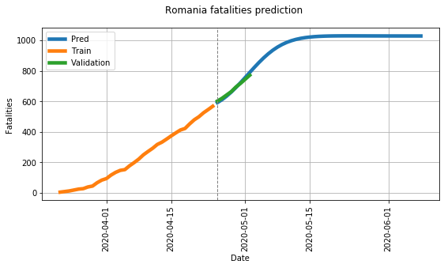
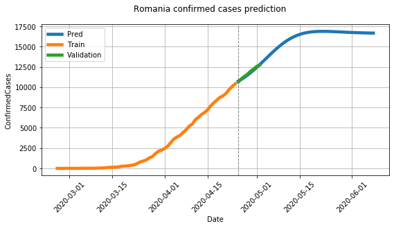
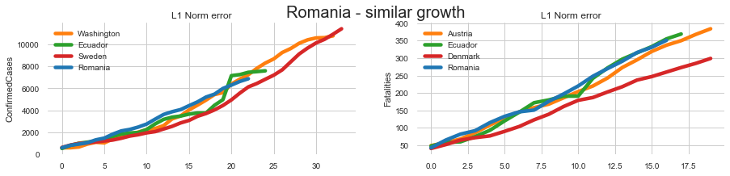
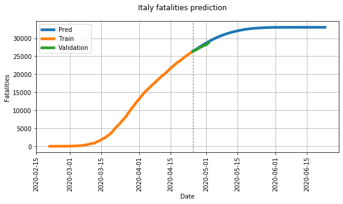
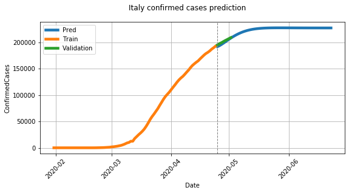

# COVID-19 Disease spread forecast
This repository implements a Recurrent Neural Network, which predicts the spread of COVID-19 accross the world. To accomplish this, a model is trained for each country, taking into account its nearest neighbors in terms of growth (later explained).

</img> </img>
## Table of contents
1. [Table of contents](#table-of-contents)
2. [Getting started](#setup)
    1. [Installation](#installation)
    
3. [Approach](#approach)
    1. [Country nearest neighbour](#country-nearest-neighbour)  
    2. [Reccurent predictor](#reccurent-predictor)
 
4. [Results](#results)
5. [References](#references)

## Getting Started

### Installation
Clone this repo runnning the following command:
```
$ git clone https://github.com/rdbch/COVID-19-Forecast/
$ cd COVID-19-Forecast 
```

Install PyTorch 1.0+ and other dependencies (pandas, numpy, seaborn, jupyter, etc).
- pip ``` $ pip install -r requirements.txt ```
- conda ```  $ conda create --name COVID-19-Forecast --file req.txt ```

**Note:** development was done using GPU accelerated version of Pytorch, so they have CUDA dependencies included.  

### Fetching the latest data
To have access to the latest data, please run
```
$ python scripts/fetch_new_data.py 
```
This will download the new global data from [Johns Hopkins University](https://github.com/CSSEGISandData/COVID-19) github repo and convert it to a more convenient format (the one used in [Kaggles COVID-19 spread](https://www.kaggle.com/c/covid19-global-forecasting-week-4)). They update the data on a daily basis.

### Running the notebooks
 To run the notebooks please start the jupyter server in ```./COVID-19-Forecast``` (parent of ./notebooks):
 ```
 $ jupyter notebook
 ```
 
## Approach
### Country nearest neighbour
**Notebook:** [link](notebooks/Covid_19_Country_growth_similarity.ipynb)

Rather than training a model for all countries, it is more suited to train a model for each individual one, using only the nearest neighbours countries in terms of growth. Please check the [this](notebooks/Covid_19_Country_growth_similarity.ipynb) notebook for more details. By doing this, we improve the predictions for the majority of countries. 

Below it is explained how the nearest neighbors of a source country **S**, are obtained:

First, we discard the entries (days) which are below a specified alignment threshold **T<sub>a</sub>** (have less than a specified number of cases), for every country (**S** included). Then, we take a candidate country, **C<sub>n</sub>**. **C<sub>n</sub>** must be more evolved than **S** (this means it reached **T<sub>a</sub>** earlier). We start sliding **S** over **C<sub>n</sub>**, beginning with the first day it reached the treshold, until **C<sub>n</sub>** ends. For each such step, an error is computed. The smallest error will be the error associated with **C<sub>n</sub>**. We do this for all countries that are available in the dataset, taking one feature f, f in {confirmedCases, fatalities} at a time. During training, the neighbours will be filtered by applying an error threshold **T<sub>error(f)</sub>**.

Below is provided a sample of the first 3 neaighbours for Romania. The data used for this was last updated on ```03 may 2020```.


### Reccurent predictor
**Notebook**:[link](notebooks/Covid_19_Country_growth_similarity.ipynb)

A naive model based of reccurent cells is implied. The predictor was only trained on the neareast neighbours. To limit the growth, an unsupervised loss is used for smoothing out the long term prediction. Please check [this](notebooks/Covid_19_Country_growth_similarity.ipynb) notebook for more details.


## Results
Below are the graphs for the results obtained for confirmed cases (left) and fatalities (right) of a country with an advanced disease spread and another with an average one. The predicted output represents a period of 60 days. 
The data used for this task was last updated on ```26.04.2020``` .

### Italy 
 
</img> </img>

### Romania

</img> </img>

## References
1. [Pytorch example - Time Sequence Prediction](https://github.com/pytorch/examples/tree/master/time_sequence_prediction)

