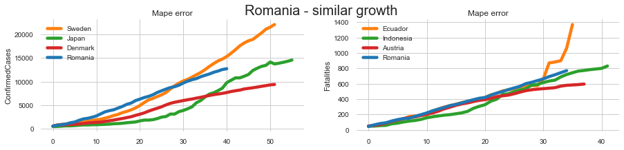

# ********* WORK IN PROGRESS *****************
# COVID-19-Playground
This repository implements Recurrent Neural Network, which predicts the spread of COVID-19 accross the world. To accomplish this, a model is trained for each country, taking into account its nearest neighbors in terms of growth (later explained).

## Table of contents
1. [Table of contents](#table-of-contents)
2. [Getting started](#setup)
    1. [Installation](#installation)
    
3. [Approach](#approach)
    1. [Country nearest neighbour](#country-nearest-neighbour)  
    2. [Reccurent predictor](#reccurent-predictor)
 
4. [Results](#results)
5. [Disclaimer](#disclaimer)

##Getting Started

### Installation
Clone this repo:
```
$ git clone https://github.com/rdbch/COVID-19-Forecast/
$ cd COVID-19-Forecast 
```

Install PyTorch and 1.0+ and other dependencies (pandas, numpy, seaborn, jupyter, etc).
- pip
```
$ pip install -r requirements.txt 
```

- conda
Note: development was done using GPU accelerated version of Pytorch, so they have CUDA dependencies included.  
``` 
$ conda create --name COVID-19-Forecast --file req.txt 
```


## Approach
### Country nearest neighbour

Rather than training a model for every country, it is more suited to train a model for each individual one, using only the nearest neighbours countries in terms of growth. Please check the [this](notebooks/Covid_19_Country_growth_similarity.ipynb) notebook for more details. By doing this, we improve the predictions for the majority of countries. 

#### Romania - average disease spread


#### Germany - evolved disease spread


### Reccurent predictor


A naive model based of reccurent cells us implied. For the exact implementation of the model, please consider taking a look at [basic_recurrent_predictor.py](core/networks/basic_recurrent_predictor.py).

The predictor was only trained on the neareast neighbours. To limit the growth, an unsupervised loss is used for smoothing out the long term prediction.

## Results
### Italy 
 
</img> </img>

### Romania

</img> </img>

## Disclaimer

