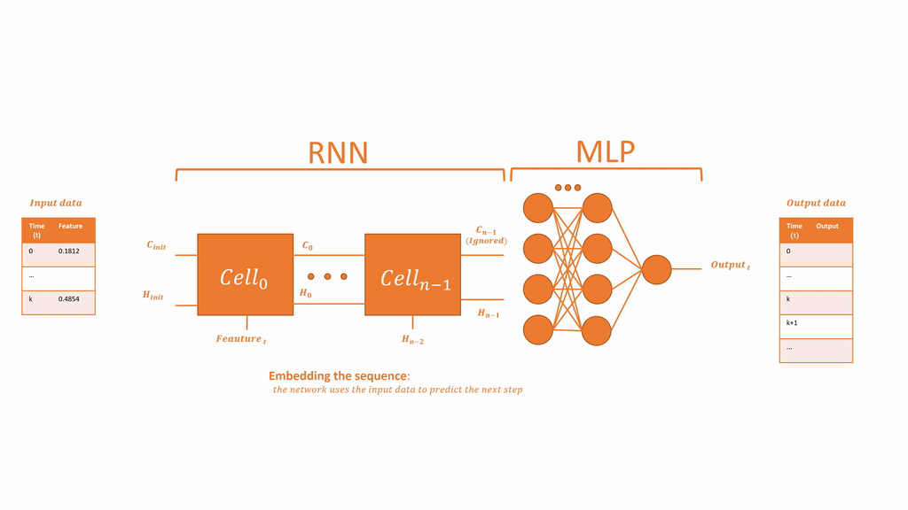

# COVID-19-Playground

## Table of contents
1. [Table of contents](#table-of-contents)
2. [Setup](#setup)
3. [Approach](#approach)
    1. [Country nearest neighbour](#country-nearest-neighbour)  
    2. [Reccurent predictor](#reccurent-predictor)
 
4. [Results](#results)
5. [Disclaimer](#disclaimer)

## Setup
To run this project you will hace to install the 
## Approach
### Reccurent predictor

### Country nearest neighbour

Rather than training a model for every country, it is more suited to train a model for each individual one, using only the nearest neighbours countries in terms of growth. Please check the [this](notebooks/Covid_19_Country_growth_similarity.ipynb) notebook for more details.

## Results
## Disclaimer

